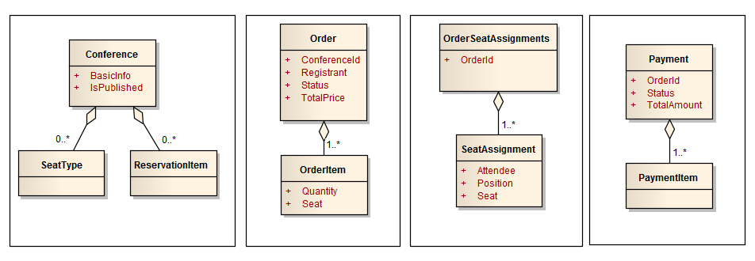

# CQRS Journey 
`Conference`项目，具体介绍参见[文档](docs/Journey_00_Preface.markdown)
## 业务简介
Conference提供了一个在线创建会议以及预订会议座位的平台。这个系统的用户有两类：
1. 客户，可以创建和管理会议
2. 会议座位预定者，可以预订会议座位。具体的关键业务描述如下

- 客户创建一个会议，并录入会议的基本信息，比如名称、时间段、地点，等；会议创建后，系统会为客户自动生成一个`AccessCode`，客户可以通过`AccessCode`访问自己创建的会议；
- 客户定义某个会议的座位类型，可以定义多个，每个座位类型包含的信息有：名称、座位价格、座位数量；
- 客户发布或取消发布某个会议，当一个会议发布后，预订者就可以在线预订会议的座位了；如果取消发布，则该会议对预订者不可见；只有未发布状态的会议才能修改；
- 预订者在预订会议座位时，会生成订单，订单需要进行支付才会生效；
- 订单生成后，预订者可以有15分钟的时间付款，超过15分钟，订单预定的座位就会回收，允许其他人预定；
- 订单生成后，系统会为预订者生成一个`AccessCode`，用户可以通过`AccessCode`查看自己的订单；
- 预订者成功预订了座位后，可以指定每个座位的实际参会人信息；
- 客户（会议的Owner）可以管理他创建的每个会议的所有订单，比如可以查看该会议的所有订单以及参会人信息，以方便联系参会人；

这个系统本质是一个简易的线上交易系统。它提供了商品管理、下订单、支付三大功能。大家可以看到，这个系统没有用户注册、登录的业务，而是简单的采用`AccessCode`来让用户访问自己的数据，因为这是一个学习案例。我之所以选择这个案例来进行分析，就是因为大家一般对电子商务系统的业务相对比较熟悉，这样我们讨论就有了一定的基础。下一篇文章，我想从DDD的角度，分析如何进行战略设计（划分子域以及BC）和战术设计（建立领域模型）。


## 限界上下文
从上面的业务描述中，我们知道，这个系统主要有三大块：
1. 会议管理
2. 预定会议
3. 支付

然后本文的目标是要对领域进行建模。而在建模之前，我们需要先划分模型的上下文边界。

首先从模块划分上分成了三个模块：
为什么这么划分，在汤老师的博客中写的很详细，我简单摘抄几句：
划分上下文之前，我们必须要对我们的业务有很深入的理解。那如何来理解业务呢？一种可行的方法就是从**场景**入手，通过分析**场景用例**来理解业务。然后我们可以从用例的所实现的业务功能的角度对用例进行分类，然后不同的分类就代表了不同的上下文。

### 业务用例
1. 客户创建会议； 
2. 客户管理会议座位； 
3. 客户发布会议； 
4. 预订人预定会议座位； 
5. 预订人支付订单； 
6. 预订人填写参会人信息； 
7. 客户查询会议的订单信息；

从用例中，我们发现1,2,3,7这几个场景，都是由客户发起，并且做的事情都是和管理会议相关。所以我们可以认为它们表示的是同一类功能，即会议管理相关的功能；我们可以把它们放在一个上下文中，我命名为会议管理上下文。 然后预订人操作的有4,5,6三个场景。那这三个场景应该在一个上下文中吗？仔细看一下，我们感觉，支付订单这个场景，最好能独立出来，因为支付的过程和逻辑往往需要和第三方系统交互。如果直接把支付耦合到处理订单的过程逻辑中，那会让订单处理的逻辑边界不清楚。所以，我们希望通过一个独立的上下文来封装和第三方支付系统交互的逻辑。这样的话，以后支付和订单处理这两块业务，都可以独立演化，互相不受影响。所以，我们又识别出了两个上下文：预定上下文、支付上下文。
> 整体的思路是先按照服务的用户来划分，然后再按照用户涉及到的外部（三方）系统来分析上下文


## 领域模型
领域建模的主要方法是，从场景出发，分析出每个场景中出现的领域概念，然后分析哪些概念是场景中的核心概念，哪些是相对次要的或者仅仅是描述性的概念。从而一步步识别出每一个聚合根。找出了聚合根之后，我们再去关心我们对每个聚合根关心哪些信息，把这些信息作为聚合根上的属性（值对象）即可。这样说可能还是比较含糊。我从另一个角度来说明一下：一般一个业务场景的结果都是核心聚合根，然后参与这个场景的所有角色的扮演者往往也是聚合根，这些聚合根最后就体现在前面我说的核心聚合根的某个属性或者子实体一部分（值对象）。比如一个买家在淘宝上下一个订单，那下订单的结果就是订单核心聚合根，然后订单由买家信息和卖家信息，这些是订单的值对象。另外，订单里还有订单明细，每个明细是一个子实体，然后订单明细里包含了商品信息，商品信息是订单明细的值对象。简单的说，这种分析思路是一种面向结果的分析法。

从上文中描述来说，我们可以分析出一些基础的领域概念，关注描述中的名词
- 客户
- 参会人信息
- 预订者
- 会议（`Conference`）
- 座位类型
- 订单
- 支付

- 这里只是对领域里出现的概念的罗列，并不是最后的领域模型。罗列这些概念，有助于我们不会在建模的过程中漏掉一些明显的概念从而导致漏掉一些聚合根的识别。
根据业务规则抽象出一下四个聚合根：


### 业务场景之 - 客户创建会议
场景结果：会议，即一个`Conference`对象；
场景参与者：客户；
`Conference`肯定是聚合根了，因为它是场景的结果。那客户是聚合根吗？不是，因为在我们的系统中，相对于会议来说，我们只关心会议是谁创建的，即会议的Owner。所以，对于`Conference`聚合根来说，客户只需要作为`Conference`聚合根的一个值对象属性即可。另一方面，我们的系统中不会对所有的客户进行维护，也就是说，客户不需要有生命周期。所以，客户不是聚合根。

另外，当这个会议有一个新的订单产生后，由于订单会先进行预扣库存的处理。所以，需要`Conference`支持预扣会议座位的支持，我们可以在`Conference`聚合根内部维护一个当前所有订单的预定信息。然后，当订单要求提交预扣信息时，才删除预扣信息，并真正扣减座位的库存余额。

最后，我们还会关心会议的一些基本信息，如名称、开始时间、结束时间、开会地点，描述，等信息；这些都作为`Conference`聚合根的属性值对象即可。另外，为了方便客户下次访问这个会议，并做后续的座位管理，系统会为这个会议聚合根自动生成一个`AccessCode`。

### 业务场景之 - 客户管理会议座位
当客户创建完会议后，客户可以凭借`AccessCode`访问管理这个会议。然后他就可以管理会议的座位信息了。这里所说的座位信息实际上是指座位的分类，比如给开发者做的座位，给嘉宾坐的位置，等。某一类座位可以设置价格以及座位数。我们很容易理解，一类座位就是`Conference`聚合根下的一个实体。因为我们需要区分是这类座位还是那类座位，且无法通过名称来区分，必须通过ID来区分。所以，我们得出结论，一个`Conference`聚合根下有一个座位分类的明细，每个座位分类明细包含了座位的名称、价格，以及数量。这里有一个业务规则需要提一下，就是当客户删除某一类座位时，系统要检查当前是否有人预定了这类座位，如果有，则不允许删除。这个规则应该也好理解。因为如果允许删除，那意味着可能有些订单的数据一致性就无法保证了。

### 业务场景之 - 客户发布会议
客户创建完一个会议后，预订者还不能理解看到预定的座位。需要客户发布该会议后，预订者才能看得到。 这个应该很好理解，就像淘宝上的宝贝，需要店家发布后才能对买家可见。同理，店家还可以下架宝贝，这样对买家就不可见了。

要实现这个功能，很简单，我们只需要为`Conference`聚合根设计一个`IsPublished`标记位属性即可。

### 业务场景之 - 预订人预定会议座位
这个场景可以说是整个系统的核心业务场景，是整个系统的核心价值所在，是我们做这个系统的目的。 就像淘宝、天猫平台的目的就是为了提供一个平台，让买家可以在平台上订购商品。淘宝天猫其他环节都可以挂，但是下订单绝对不能挂。可见下订单业务的可用性是多么重要。所以，我们应该花最好的资源，最多的时间，做最好的设计，在这一块业务上面。

这个场景的交互流程大概是下面这样的：

预订者浏览某个已发布的会议；
进入会议的详情页面，该页面显示了所有可预订的座位分类信息；
预订者选择好要预订的座位分类，录入每个分类的预定数量；
点击提交按钮，提交订单；
系统处理订单，处理订单；
处理订单的主要步骤是：
1. 生成订单（初始状态，对用户不可见）； 
2. 扣减库存（内部有预扣逻辑）； 
3. 修改订单状态； 
4. 通知预订者下单是否成功；

如果下单成功，预订者被导航到支付页面进行支付；预订者可以选择支付，也可以放弃支付；
如果支付成功，则提示预订者订单处理完成，交易完成；如果放弃支付，则关闭订单；如果超过规定时间（15分钟）未支付，则视作订单已过期，系统自动回收订单所预定的座位；
如果订单交易完成，则预订者可以通过系统给定的`AccessCode`访问自己的订单，然后可以接下来安排预定座位的参会人信息；
预定流程结束；
通过上面的流程我们知道，整个场景主要都是在围绕订单在进行处理。所以，毫无疑问，订单是核心聚合根，且订单有一个状态，表示当前被处理的阶段。然后，订单在一定的业务规则下进行状态变更。订单的状态是订单的核心属性。那我们如何设计订单的状态呢？还是要分析上面的订单处理流程。通过上面的分析我们可以知道，订单处理主要有：订单生成、减库存、支付三个环节。所以我们可以针对每个环节可能出现的不同情况，设计不同的状态即可。目前我设计了如下的状态枚举：

```java
    Placed(1),                //订单已生成
    ReservationSuccess(2),    //位置预定已成功（下单已成功）
    ReservationFailed(3),     //位置预定已失败（下单失败）
    PaymentSuccess(4),        //付款已成功
    PaymentRejected(5),       //付款已拒绝
    Expired(6),               //订单已过期
    Success(7),               //交易已成功
    Closed(8);                //订单已关闭
```

当订单创建出来后，默认状态为`Placed`；
然后系统自动去进行预扣座位的库存，如果预扣成功，则状态为ReservationSuccess；
失败，则状态为ReservationFailed；
如果预扣成功，那用户就可以去支付页面支付订单，如果支付成功，则状态为`Payment`Success；
如果用户拒绝支付，则状态为`Payment`Rejected；
如果用户忘记支付，超过规定时间，则状态由系统自动设置为Expired，即过期；
如果用户支付完成，则状态为Success，即订单交易成功；
最后，当订单过期或用户拒绝付款后，订单最后的状态会被设置为Closed，即关闭。

这些状态是我对这个系统的理解设计出来的，和微软的`Conference`案例并不同。这里我不对微软的案例做分析，大家有兴趣的可以自己去看一下。

大家可以看到，整个订单的状态还是比较多的，订单处理的流程也有点复杂。订单处理的流程是我们的系统的关键，我们需要用最好的最健壮的设计来支持它。

我们再来看看订单还有什么其他的重要信息我们需要关心的。订单的明细也是必须要关心的，没有明细的订单就不是一个有效的订单。明细包括什么？这些都很简单，大家都思考过。那就是需要包括预定的`Conference`的座位信息以及数量，也就是说，我们关心这个订单预定了哪个`Conference`的哪些座位，分别预定了多少个。这里我就不展开了。

最后，我们还关心预订人的信息，因为我们总要知道是谁预定了这些座位的。

### 业务场景之 - 预订人支付订单
上面的订单处理流程中，还有一个很重要的环节就是订单支付。上面分析上下文时我们知道了支付是在一个独立的上下文中处理的。那这个上下文要负责做什么事情呢？我想，主要的事情就是：

根据订单生成支付信息；
然后提供用户支付功能（可以跳转到其他外部网站进行实际支付）；
向订单处理的上下文通知支付结果；
总结起来，就是负责封装支付信息（`Payment`）的存储以及与外部系统集成以便完成实际支付的交互逻辑；

订单支付现实生活中，就是像在淘宝上买东西后跳转到支付宝站点那样，进行付款。而我们这个由于只是一个案例，所以没有真正实现支付的功能。但是我们可以通过做一个简单的页面来模拟这个支付的场景。比如通过提供用户一个页面，让用户来选择是否同意支付。如果用户选择同意，则系统认为用户已经支付完成；如果用户选择拒绝，则系统认为用户拒绝支付；不管用户选择哪个，都把支付的结果通知给订单处理上下文即可。对于订单处理上下文，它不关心支付的细节，只关心支付的结果。

所以，我们很清楚的知道，我们需要设计一个`Payment`聚合根，表示订单的支付信息。Payment需要记录是对哪个订单的支付，同时还可以记录这次支付的具体明细描述（可以来自订单信息的明细）。同时，还会关心此次支付共需支付多少钱，以及支付的结果（比如成功还是拒绝）。

### 业务场景之 - 预定人填写参会人信息
当预订人支付完成后，订单状态就变成交易成功了。然后预订人就可以开始填写他预定的座位的参会人的信息了，主要填写参会人的姓名和联系方式即可。方便`Conference`的Owner与参会人联系。那问题是，这些参会人信息需要聚合在Order聚合根下吗？你可以聚合。但我选择不聚合，理由是：此时订单的生命周期可以理解为已经结束了，然后预订人填写参会人信息，是属于后续的活动操作。所以，我们应该用新的聚合根来跟踪这个活动，这个聚合根关心的是这个订单的所有参会人信息，以及每个参会人和对应的座位的对应关系的维护。这些信息由订单来维护不是很妥当，订单的职责是记录预定的座位的信息以及记录订单处理的状态，一旦订单处理完成，那他的生命周期就结束了。它不关心预订人后面又做了什么事情。所以，我设计了一个新的聚合根叫**`OrderSeatAssignments`**。

### 业务场景之 - 查看会议信息、查看订单信息
这个场景只涉及到数据的查询，不涉及到修改。所以，对领域建模无影响，我就忽略了。


- `Payment`

- `Conference`

- `Order`

- `OrderSeatAssignments`
## 参考资料
- https://www.cnblogs.com/netfocus/p/4605324.html